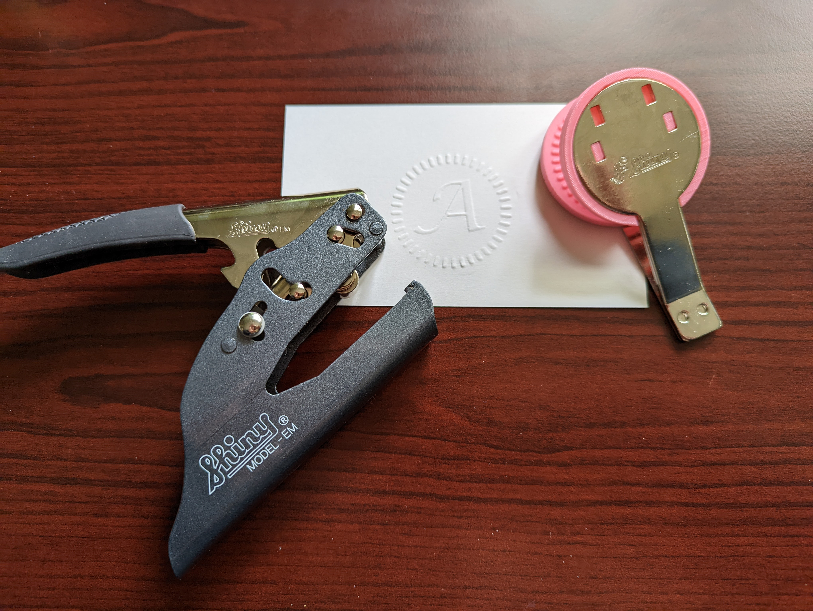

# EmbosserPlate

3D printable plates for the Shiny model EM embosser. Made using CadQuery.

I got a good deal on [a handheld embosser](https://www.ebay.com/itm/282778433485), which came with a blank plate. These printed inserts fit over that plate.

